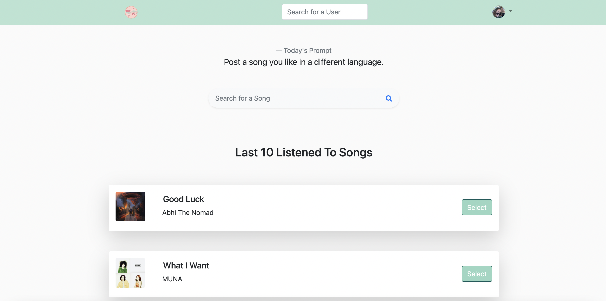
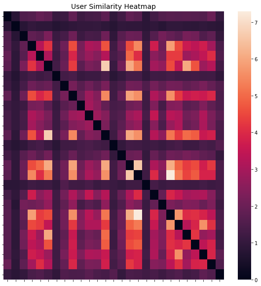
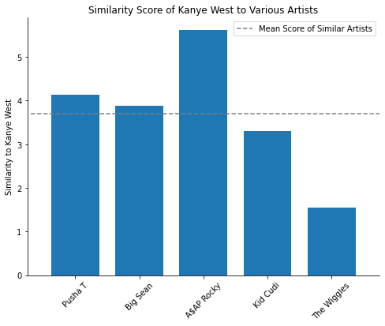

# Ay-Yo! User Similarity & Discovery
# Task 1: Calculating User Similarity Metric between Ay-Yo! User Profiles
## Introduction
A few months ago, we created a music-sharing social media called Ay-Yo!, which encourages users to post a song every day. To improve functionality for our social media, we began thinking of ways to connect similar users. Any good social media has an algorithm to recommend similar users that one might enjoy following. Rather than using traditional matrix factorization, we wanted to explore if we could determine how similar users' tastes in music are by applying Natural Language Processing to the songs they have posted.

## Algorithm Overview
In order to calculate user similarity, we need some way to numerically represent a user's taste in music. The only data we have for users is the title of the songs that they have posted. Our process was:
1. pull lyrics for each song a user has posted
2. tokenize song lyrics
3. obtain vector representation of song by taking average of token embeddings
4. obtain vector representation of user by taking average of embeddings of songs they have posted
5. compute similarity between users by taking Euclidean distance of their user vectors
## Data Collection
Our main data sources were the Ay-Yo! database hosted on AWS DynamoDB, which we connected to via boto3, and the Genius API, which we connected to via the lyricalgenius Python package. We used the Ay-Yo! database to collect the names of each song posted by each user, and the Genius API to collect the associated lyrics for each song.
## Preprocessing
### Tokenization
To improve our similarity metric, we tried various different tokenization techniques. We tried a custom tokenization that attempted to transform song lyrics into individual words, as well as a pretrained sub word tokenizer. Different tokenization techniques gave us different similarity scores, but the rank order of similar users remained the same. We chose to use the pretrained Bert tokenizer, as it showed us the greatest difference in the similarity score between two similar artists and the similarity score between two non-similar artists.
### Embeddings
 We also tried various word embedding techniques. Because our dataset was small (Ay-Yo! only has about 20 users, each of whom have posted between 1 and 30 times), we used transfer learning with pretrained embeddings. No point in reinventing the wheel, especially when we have access to a Mercedes in the form of GloVe embeddings. The GloVe embeddings have been trained on an extremely large corpus of text, thus they are better than any word embedding we could train ourselves. We tried embeddings trained on different corpuses, including Wikipedia and Twitter. Again, the different embeddings gave different similarity metrics, but the rankings remained the same, so we chose the embedding which gave us the greatest variation in similarity scores for similar artists and non-similar artists, which was the GloVe embedding trained on the Wikipedia corpus. It is interesting to note that both the tokenizer and embeddings we deemed most suited to our task were both trained on Wikipedia text.
## Analysis
By applying tokenization and embedding, we obtained a vector representation of each token ($\vec x_i$) in a song. We then took the average of the vector representations of each token to represent the song.
$$\vec v_{\text{song}} = \frac1n \sum_{i=1}^n \vec x_i$$
We then took the average of the representation of each song posted by a user to represent the users.
$$\vec u_{\text{marti}} = \frac1n \sum_{i=1}^n \vec v_i$$
Finally, we computed the similarity score between user representations. $$\text {similarity score = }\frac 1 {\lVert \vec u_i - \vec u_j \rVert}$$
## Results
Generally, the results from our investigation were encouraging! This was inherently an unsupervised task, as we were unable to label or validate that users are similar. However, we still found some interesting insights. We saw good variation in similarity scores, even for our small user base, which indicates that these scores could theoretically be used to recommend similar users.

### Validation
We generated fake users who only listen to one artist to use for validation. We compared a user who only listens to Kanye West to users who only listen to ASAP Rocky, Kid Cudi, Pusha T, and Big Sean (who are listed on Spotify as similar artists). We also compared our fake Kanye fan to a user who only listens to The Wiggles (a reasonably non-similar artist). As expected, the

 similarity scores were much higher for similar artists than for non similar artists, indicating that our algorithm is working.

# Task 2: Use vector representations as features to predict implicit ratings
## Introduction
Another functionality we are thinking about introducing to Ay-Yo! is recommendations. Ay-Yo! is unique because users post songs in response to written prompts, so our assumption and observation is that users often take song lyrics into consideration when making their posts. For example, a prompt asking users to post their "Favorite song of the Summer" can be expected to be answered with songs talking about "sun", "beach", "surfing", "partying", etc. In other words, we anticipate their might be a correlation between lyrics and how users like to respond to prompts. Thus, we think it is important to leverage the embeddings we used for the similarity calculations in song recommendation as well. We can augment the lyric features with features from Spotify about qualities not captured by lyrics such as "danceability" and "loudness".
## Algorithm Overview
In order to accomplish effective predictions that incorporate user lyrical histroy, we need to use the vector represenations we generated for our similarity calculations. From there, we did the following:
1. Retrieved additional non-lyrical song features, such as energy or loudness, using the Spotify API
2. Assigned each Ay-Yo! user and their posts to the positive class (“1”)
3. Generated negative samples by leveraging our similarity metric. By this, we mean we assigned each Ay-Yo! User and the posts of their least similar Ay-Yo! Counterpart to the negative class (“0”).
4. For each user/song combination: we had information about the song from Spotify, the song’s lyrical embedding, and the user’s centroid (vector representation)
5. Combines all the data to predict implicit ratings (1/0) using a 2-layer neural network 6.cHyperparameter tuned the hidden layer size using validation metrics
7. Applied weight decay as a regularization technique to improve generalizability and to try to prevent overfitting to the training data.
## Data Collection
For this step of the project, we used the Spotify API to get additional information on each song we had in our dataset.
## Analysis
We used a 2-layer neural network with a ReLu. For our loss function, we used Binary Cross Entropy. We chose Adam as our optimizier.
Our baseline model metrics were:

 - Training Loss: 0.6995
- Validation Loss : 0.6943
When we initially began training, we noticed that the loss appeared to continue to decrease beyond 20 epochs for both training and validation. For our best perfoming model on the 20 epochs, we trained for 350 epochs.
## Results
We performed a condensed grid search on the optimal value of the hidden size parameter and found 150 to lead to the best performance.
With more time and data, it would be beneficial to do an extensive grid search rather than just a few values.
Our best model metrics were: - Training Loss: 0.2950
- Validation Loss : 0.3901
Overall, we had 57.1532% decrease in training loss from baseline and a 43.8139% decrease in validation loss from baseline.
The generalizability of our model still needs improvement. Weight decay worked in reducing validation loss to an extent, then validation loss began to plateau at around 200 epochs. Other techniques should be explored.
## Future Extensions
1. Augmentation for Matrix Factorization
To take this project further in the future, we considered using our vector representations of users' taste in music as a feature in a more in-depth matrix factorization model. This would allow us to leverage the well-established power of matrix factorization with our additional knowledge about a user's taste in music, hopefully solving or alleviating the cold start problem.
2. Ay-Yo! Enhancement
Additionally, we could apply the similarity scores we generated to make Ay-Yo! more engaging and interactive. For example, we could display your similarity to another user every time you click on another users profile. We could also use similarity scores to rank relevant results in our search algorithms.
## Sources/Dependencies
- Ay-Yo! Homepage: https://ay-yo.click
- Lyricalgenius package: https://pypi.org/project/lyricsgenius/
- GloVe 6B 300d embeddings: https://www.kaggle.com/datasets/thanakomsn/glove6b300dtxt

- AWS: to run our notebook, you would need AWS keys to connect to our Ay-Yo! database but for privacy reasons, we cannot publish those keys
