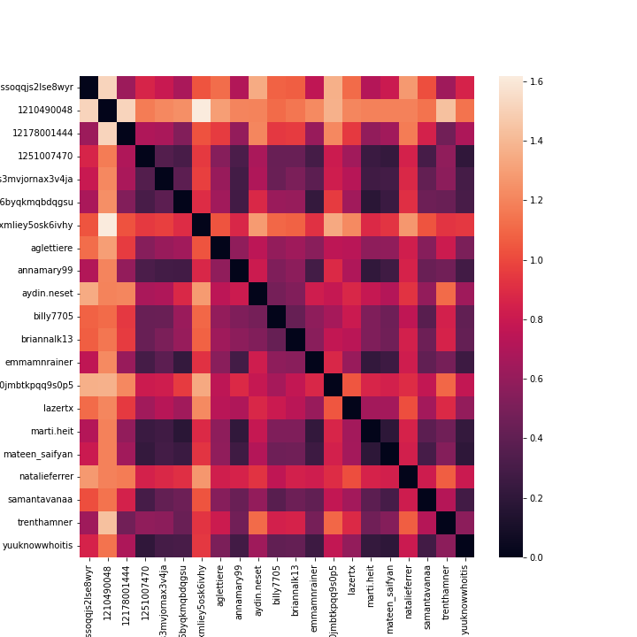

# Ay-Yo! User Similarity

## Introduction
A few months ago, we created a music-sharing social media called Ay-Yo!, which encourages users to post a song every day. To improve functionality for our social media, we began thinking of ways to connect similar users. This is inherently an unsupervised task, as we are unable to label or validate that users are similar. 

## The Process
In order to calculate user similarity, we need some way to numerically represent a user's taste in music. The only data we have for users is the title of the songs that they have posted. Our process was:
1. pull lyrics for each song a user has posted
2. tokenize song lyrics
3. obtain vector representation of song by taking average of token embeddings
4. obtain vector representation of user by taking average of embeddings of songs they have posted
5. compute similarity between users by taking Euclidean distance of their user vectors

### Tokenization
To improve our similarity metric, we tried various different tokenization techniques. We tried a custom tokenization that attempted to transform song lyrics into individual words, as well as a pretrained sub word tokenizer.

### Embeddings
We also tried various word embedding techniques. Because our dataset was small (Ay-Yo! only has about 20 users, each of whom have posted between 1 and 30 times), we used transfer learning with pretrained embeddings. No point in reinventing the wheel, especially when we have access to a Mercedes in the form of GloVe embeddings. The GloVe embeddings have been trained on an extremely large corpus of text, thus they are better than any word embedding we could train ourselves. We tried embeddings trained on different corpuses, including Wikipedia and Twitter. While the different embeddings gave different similarity metrics, the rankings remained the same.

## Results
The results from our investigation were encouraging! As mentioned, this was an unsupervised task, so we were unable to compute performance metrics, but we used our best judgement to evaluate results.

